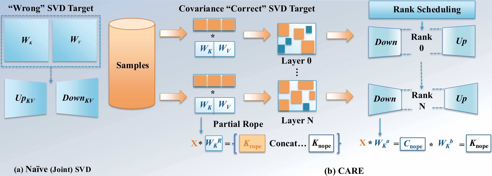

# 🌀 CARE: Covariance-Aware and Rank-Enhanced Decomposition for Enabling Multi-Head Latent Attention

**Published as a conference paper at ICLR 2026**

[Website](https://zzz0906.github.io/CARE/) | [Paper](assets/main.pdf) | [Overview](#overview) | [Results](#results) | [Quick Start](#quick-start) | [Citation](#citation)

> Zhongzhu Zhou, Fengxiang Bie, Ziyan Chen, Zhenyu Zhang, Yibo Yang, Junxiong Wang, Ben Athiwaratkun, Xiaoxia Wu, Shuaiwen Leon Song
>
> University of Sydney, KAUST, Together AI, UT Austin

---

Converting pretrained GQA/MHA models into **Multi-Head Latent Attention (MLA)** can dramatically reduce KV-cache cost without retraining from scratch. However, naive SVD initialization minimizes weight error rather than activation error and enforces uniform rank across layers — causing activation drift and degraded attention fidelity.

**CARE** addresses both shortcomings:

1. **Activation-preserving factorization** — SVD on the whitened operator sqrt(C)W, then unwhitening via sqrt(C)^{-1}, so the approximation aligns with actual input activations rather than just weights.
2. **Adjusted-rank scheduling** — a singular-value-guided greedy allocation that distributes a fixed KV budget unevenly across layers, giving more capacity to spectrally complex layers.
3. **KV-parity mapping** — reparameterizes converted K and V into the MLA format while keeping the KV-cache size unchanged.

CARE outperforms uniform-rank SVD baselines on **Qwen3-4B/30B-A3B** and **Llama-3.1-8B/70B**, reducing one-shot perplexity by up to **215x** and improving mean accuracy by up to **1.70x** at matched KV budgets.

## Overview

<p align="center">
  
</p>

**(a) Naive (Joint) SVD** factorizes W_K and W_V directly and truncates to a uniform per-layer rank, optimizing weight error while ignoring layerwise heterogeneity. **(b) CARE** estimates activation covariance C from calibration data, factorizes sqrt(C)W, and unwhitens via sqrt(C)^{-1} to initialize MLA factors. The singular spectrum of sqrt(C)W drives a global dynamic rank scheduler under KV parity, preserving activation geometry and yielding a stronger one-shot initialization.

## Results

### One-Shot Perplexity (WikiText-2, lower is better)

| Model | Rank | SVD (Palu) | ASVD | MHA2MLA | CARE-U | CARE-E |
|-------|------|-----------|------|---------|--------|--------|
| Llama-3.1-8B | 128 | 7.5e4 | 2525 | 2.8e5 | 89.9 | **72.0** |
| Llama-3.1-8B | 256 | 2561 | 115 | 5236 | 68.5 | **64.8** |
| Qwen3-4B | 128 | 5.7e4 | 6684 | 1.2e5 | 102 | **53.3** |
| Qwen3-4B | 256 | 1093 | 267 | 4965 | 47.7 | **37.2** |

### Post-Healing Accuracy (LM-Eval, higher is better)

With a brief post-SVD "healing" fine-tune, CARE fully recovers the original model's accuracy while maintaining the MLA KV-cache reduction.

## Quick Start

### Environment Setup

```bash
conda create -n care python=3.12 -y
conda activate care
pip install torch transformers datasets accelerate tqdm lm-eval gpustat
```

Set your HuggingFace token for gated models:
```bash
export HF_TOKEN=hf_xxx
```

All shell launchers source `scripts/lib/common.sh`, which adds `src` to `PYTHONPATH` and optionally activates `CONDA_ENV`.

### Zero-Shot K/V Decomposition Evaluation

Evaluate decomposition quality without building full MLA modules:

```bash
PYTHONPATH=src python -m zeroshot.convert \
  --model-path meta-llama/Llama-3.1-8B-Instruct \
  --method care \
  --rank 256 \
  --cal-dataset alpaca
```

Add `--dynamic-rank` for adjusted-rank scheduling.

### Parallel Zero-Shot Sweeps

Run all methods/ranks in parallel across GPUs:

```bash
bash scripts/zeroshot/run_parallel_llama3.1_8B.sh
bash scripts/zeroshot/run_parallel_qwen3_4B.sh
```

For large models (30B+/70B) that require multi-GPU:

```bash
CUDA_VISIBLE_DEVICES=0,1,2,3 bash scripts/zeroshot/run_parallel_llama3.1_70B_rank_only.sh
```

### MLA Conversion Pipeline

```bash
PYTHONPATH=src python -m cli.convert \
  --model-path meta-llama/Llama-3.1-8B-Instruct \
  --save-path outputs/llama-3.1-8B-mla \
  --kv-lora-rank 256 \
  --kv-decomp-method transmla-care
```

Available `--kv-decomp-method` options:
- `transmla` — PCA-based projection (TransMLA baseline)
- `transmla-care` — CARE with covariance-aware eigenbasis projection
- `care` — sqrt-covariance weighted SVD decomposition
- `no-sqrt-care` — covariance weighted SVD (no sqrt)

Additional options:
- `--cal-mode full|layerwise|auto` — calibration strategy (default: auto)
- `--cal-dataset wikitext2|alpaca|c4|ptb` — calibration data (default: wikitext2)
- `--dynamic-rank` — enable adjusted-rank scheduling across layers

## Citation

If you find this work useful, please cite:

```bibtex
@inproceedings{zhou2026care,
  title     = {{CARE}: Covariance-Aware and Rank-Enhanced Decomposition for Enabling Multi-Head Latent Attention},
  author    = {Zhou, Zhongzhu and Bie, Fengxiang and Chen, Ziyan and Zhang, Zhenyu and Yang, Yibo and Wang, Junxiong and Athiwaratkun, Ben and Wu, Xiaoxia and Song, Shuaiwen Leon},
  booktitle = {International Conference on Learning Representations (ICLR)},
  year      = {2026}
}
```

## License

This project is licensed under the Apache License 2.0. See [LICENSE](LICENSE) for details.

## Acknowledgments

This codebase builds upon [TransMLA](https://github.com/MuLabPKU/TransMLA) (MIT License) by Meng et al. We thank the TransMLA authors for open-sourcing their MLA conversion framework, which served as the foundation for our implementation.
